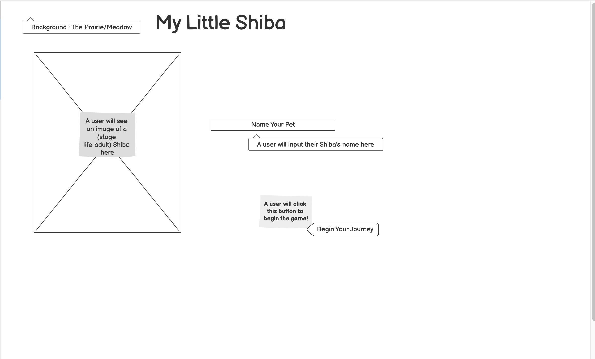

Project 1 Shibagotchi 

This is an adaptation of an oldtimey game : Tamagotchi where the user will be able to adopt/name/raise/love their own virtual Shiba! 
The main landing page will display a puppy Shiba for the user, along with an option to name their new pet and initiate the game. My goal is to be able to create an inviting landing page that will entice the user to want to explore the game further; in addition to basic CSS design for this landing page, I'm hoping to be able to added a song that will play once the landing page opens. 
  

